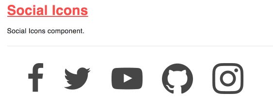

## What are Twig Macros
Before we start diving into embedding SVG icons using Twig macros, let's discuss what a Twig macro is.  If you read Twig's documentation, Macros are defined as follows:

_Macros are comparable with functions in regular programming languages. They are useful to put often used HTML idioms into reusable elements to not repeat yourself._

Here is a small example of a macro that renders a form element:
```

    <input type="{{ type|default('text') }}" name="{{ name }}" value="{{ value|e }}" size="{{ size|default(20) }}" />

```
Macros differ from native PHP functions in a few ways:

* Default argument values are defined by using the default filter in the macro body;
* Arguments of a macro are always optional.
* If extra positional arguments are passed to a macro, they end up in the special varargs variable as a list of values.

## What are we building today
Today we will go over how to write a macro which will allow us to embed SVG images or icons in our site.  These icons can be any type of icons such as navigation icons, social media icons or any image you want to embed as SVG.
There are serveral steps to making this happen.

Here's an example of of what we are building today.  We want to cycle through a list of links and be able to embed an icon to each link based on the link type (i.e. twitter, facebook, instagram, etc.).



## Write the macro
```

  

```

## Hosting the SVG code
We are going to create a twig file so we can embed the SVG code in it.  This may seem extrange but trust me, it works.

* Create a new file and name it `facebook.svg.twig`
* In it, paste the SVG code below and save the file.

```
<svg aria-hidden="true" role="img" class="{{ classNames|default('') }}" xmlns="http://www.w3.org/2000/svg" width="11" height="20" viewBox="0 0 11 20"><path d="M10.703.134V3.08H8.951q-.96 0-1.295.402t-.335 1.205v2.109h3.27l-.435 3.304H7.321v8.471H3.906V10.1H1.06V6.796h2.846V4.363q0-2.076 1.161-3.22T8.159-.001q1.641 0 2.545.134z"/></svg>
```
### Write the structure for our component
```
{
  "items":[
    {
      "icon": "facebook",
      "url": "#"
    },
    {
      "icon": "twitter",
      "url": "#"
    },
    {
      "icon": "youtube",
      "url": "#"
    },
    {
      "icon": "github",
      "url": "#"
    },
    {
      "icon": "instagram",
      "url": "#"
    }
  ]
}
```
What we've done above is write a JSON object which holds an array of items.  Each item has two properties: 1- icon, and 2- url.  You can do the same with YML if you prefer.

### Writing the logic for our macro
```php



  <ul class="social-icons">
  
    <li class="social-icons__item">
      <a href="{{ item.url }}" class="social-icons__link">
        {{ icons.get(item.icon, 'social-icons__icon') }}
        <span class="social-icons__name">{{ item.icon }}</span>
      </a>
    </li>
  
  </ul>

```
**Let's go over the code above**

* We are wrapping our icons in an *Unordered List* (UL)
* Then we loop through the **items** array
* For each item we create a **List Item** (li) and assign a class of `social-icons--item`
* Next we print an anchor to which we pass the **URL** value from the JSON object and also assign a css class (`social-icons--link`).  These classes are optionals
* Here's the interesting part, we then call in the **get** method for the icons macro and pass the `icon.name` as a parameter.  This will grab the **name** value from the JSON object.  This name value needs to match the first part of the name of the twig template we created above (`facebook.svg.twig`)
* Lastly, we print the icon name for accessibility purposes.
